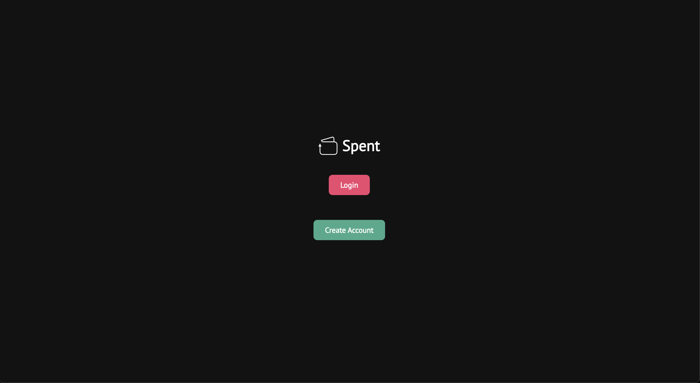
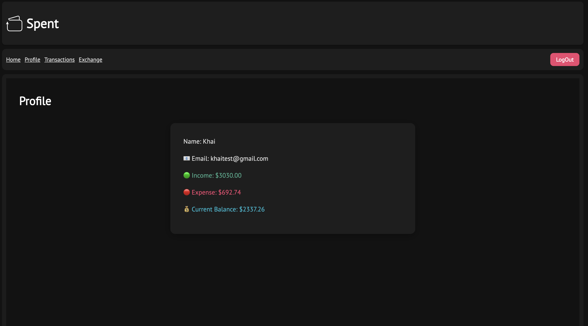

# Description
Spent is a personal finance tracking web application built using JavaScript, Prisma, HTML, CSS, MySQL, and RESTful APIs. It allows users to manage their expenses and income by recording transactions, categorizing them, and viewing financial summaries. The app also comes with a built-in currency exchange utilizing fixer.io API.

# Demo 
Demo link - spent-beta.vercel.app

`Homepage`

`Dashboard`

`Profile page`

`Transaction page`

`Currency exchange`

